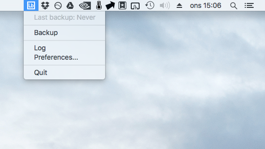
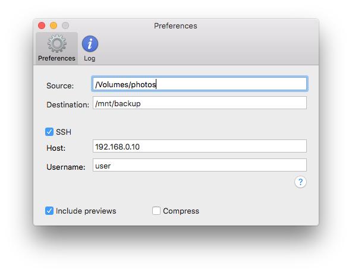

# What is Lr-backup?
Lr-backup is a small application that lives in the status bar of OS X, making it easy to back up your Photoshop Lightroom library either locally or to a remote machine using ssh.

# What exactly does it back up?
* Photos and other content
* Lightroom library files (.lrcat)
* Lightroom preview files (.lrdata) (optional)

# How does it work then?
Lr-backup is based on the widely used file transfer utility rsync (not to be confused with NSYNC) for backing up both locally and remotely. Just set up the source and destination of your backup, and you're good to go. 

In order to back up to a remote machine user authentication via ssh keys is required. Please see https://www.digitalocean.com/community/tutorials/ssh-essentials-working-with-ssh-servers-clients-and-keys for more information on how to set it all up.

# License
The MIT License (MIT)

Copyright (c) 2015 Karl Persson

Permission is hereby granted, free of charge, to any person obtaining a copy of this software and associated documentation files (the "Software"), to deal in the Software without restriction, including without limitation the rights to use, copy, modify, merge, publish, distribute, sublicense, and/or sell copies of the Software, and to permit persons to whom the Software is furnished to do so, subject to the following conditions:

The above copyright notice and this permission notice shall be included in all copies or substantial portions of the Software.

THE SOFTWARE IS PROVIDED "AS IS", WITHOUT WARRANTY OF ANY KIND, EXPRESS OR IMPLIED, INCLUDING BUT NOT LIMITED TO THE WARRANTIES OF MERCHANTABILITY, FITNESS FOR A PARTICULAR PURPOSE AND NONINFRINGEMENT. IN NO EVENT SHALL THE AUTHORS OR COPYRIGHT HOLDERS BE LIABLE FOR ANY CLAIM, DAMAGES OR OTHER LIABILITY, WHETHER IN AN ACTION OF CONTRACT, TORT OR OTHERWISE, ARISING FROM, OUT OF OR IN CONNECTION WITH THE SOFTWARE OR THE USE OR OTHER DEALINGS IN THE SOFTWARE.
